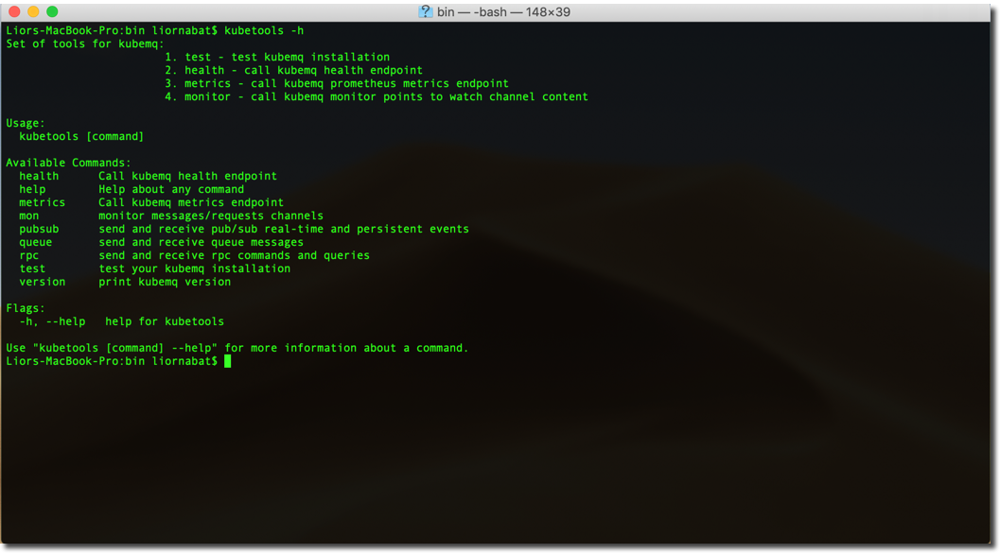

# Kubetools


Kubetools provides access to [KubeMQ](https://kubemq.io) via a command-line interface.

It currently provides the ability to:

- **Test KubeMQ server installation** from the command line and verify proper configuration.
- **Execute Queue, Pub/Sub and RPC commands** message patterns.
- **Monitor Channels** and view messages.
- **Check Health** and get simple stats.
- **Get Metrics** detailed data

If there is something you'd like to see Kubetools be able to do from the CLI, let us know! :)

## Installation

### Mac OS:

```bash
curl -L https://github.com/kubemq-io/kubetools/releases/download/latest/kubetools_darwin_amd64 -o /usr/local/bin/kubetools 
chmod +x /usr/local/bin/kubetools
```

### Linux 64 bits:

```bash
curl -L https://github.com/kubemq-io/kubetools/releases/download/latest/kubetools_linux_amd64 -o /usr/local/bin/kubetools
chmod +x /usr/local/bin/kubetools
```


### Linux 32 bits:

```bash
curl -L https://github.com/kubemq-io/kubetools/releases/download/latest/kubetools_linux_386 -o /usr/local/bin/kubetools
chmod +x /usr/local/bin/kubetools
```

### Windows:

Run in PowerShell as administrator:

```powershell
New-Item -ItemType Directory 'C:\Program Files\Kubetools'
Invoke-WebRequest https://github.com/kubemq-io/kubetools/releases/download/latest/kubetools.exe -OutFile 'C:\Program Files\Kubetools\kubetools.exe'
[Environment]::SetEnvironmentVariable('Path', [Environment]::GetEnvironmentVariable('Path', [EnvironmentVariableTarget]::Machine) + ';C:\Program Files\Kubetools', [EnvironmentVariableTarget]::Machine)
$env:Path += ';C:\Program Files\Kubetools'
```

Or manually:

- [Download the latest kubetools.exe](https://github.com/sourcegraph/src-cli/releases/download/latest/kubetolls.exe).
- Place the file under e.g. `C:\Program Files\Kubetools\kubetools.exe`
- Add that directory to your system path to access it from any command prompt


## Configuration
Kubetools require `.config.yaml` File for connections variables. Default configuration:

```
healthAddress: "http://localhost:8080/health" # the address of Health endpoint , you can replace the localhost:8080 with your address
metricsAddress: "http://localhost:8080/metrics" #the address of Health endpoint, you can replace the localhost:8080 with your address
monitorAddress: "ws://localhost:8080/v1/stats" #the address of Monitor endpoint, you can replace the localhost:8080 with your address
connections:
  - kind: 1 # 1 - grpc 2- rest
    host: "localhost" # host destination
    port: 50000 # port destination
    isSecured: false # set using https
    certFile: "" # set location of cert file
  - kind: 2 # 1 - grpc 2- rest
    host: "localhost" # host destination
    port: 9090  # port destination
    isSecured: false  # set using https
    certFile: "" # set location of cert file - not in use for Rest

```

## Documantation
Please visit our [docs](https://docs.kubemq.io/tutorials/kubetools.html) for detailed Kubetools documentation.